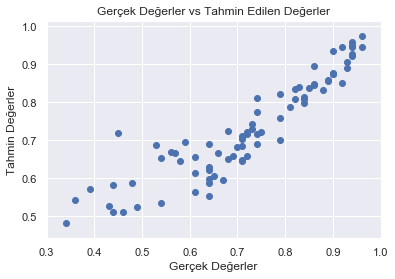
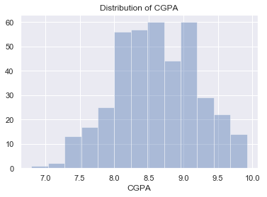

# Doğrusal Regresyon ile Kabul Tahmin Projesi

## Veri Seti

Projede kullanılan veri seti "Admission_Predict.csv" adlı dosyadır. Bu veri seti, öğrencilerin akademik performansına dair bilgileri ve kabul şanslarını içermektedir. Veri seti şu sütunlardan oluşmaktadır:

1. **GRE Puanları** (340 üzerinden)
2. **TOEFL Puanları** (120 üzerinden)
3. **Üniversite Derecesi** (5 üzerinden)
4. **Niyet Mektubu ve Referans Mektubu Gücü** (5 üzerinden)
5. **Lisans Not Ortalaması (GPA)** (10 üzerinden)
6. **Araştırma Deneyimi** (0 veya 1)
7. **Kabul Şansı** (0 ile 1 arasında)

Data Linki : https://www.kaggle.com/datasets/mohansacharya/graduate-admissions/code

## Modelin Eğitimi

### İzlenen Adımlar:
1. **Veri Ön İşleme**: Veriler Pandas kütüphanesi ile yüklendi, eksik veya boş veri olup olmadığı kontrol edildi. "Serial No." sütunu model için gereksiz olduğu için çıkarıldı.
   
2. **Özellik Seçimi**: "Chance of Admit" dışındaki tüm sütunlar bağımsız değişken (X), "Chance of Admit" ise bağımlı değişken (y) olarak belirlendi.

3. **Veri Setini Ayırma**: Veri seti, %80 eğitim ve %20 test olarak ikiye ayrıldı.
   
4. **Model**: Scikit-Learn kütüphanesinin `LinearRegression` sınıfı kullanılarak basit bir doğrusal regresyon modeli eğitildi.

### Kullanılan Hata Metrikleri:
- **MAE (Ortalama Mutlak Hata)**: Hataların mutlak değerlerinin ortalamasını ölçer.
- **MSE (Ortalama Kare Hatası)**: Hataların karelerinin ortalamasını ölçer.
- **RMSE (Kök Ortalama Kare Hatası)**: MSE'nin karekökü alınarak bulunur.
- **R² (R-kare Skoru)**: Modelin hedef değişkenin değişkenliğini ne kadar iyi açıkladığını gösterir.

### Model Sonuçları:
- **MAE**: 0.0479
- **MSE**: 0.00417
- **RMSE**: 0.0679
- **R² Skoru**: 0.8212

Bu sonuçlar, modelin makul bir hata oranına sahip olduğunu göstermektedir.

## Tahminler

Model eğitildikten sonra test verisi üzerinde tahminler yapıldı. Aşağıdaki grafikte, tahmin edilen değerler ile gerçek değerler karşılaştırılmıştır:

- **Dağılım Grafiği**: Gerçek ve tahmin edilen değerler arasındaki farkı gözlemlemek için bir dağılım grafiği oluşturulmuştur.

## Görselleştirmeler

Proje boyunca veri setini ve model sonuçlarını analiz etmek için aşağıdaki görselleştirmeler kullanıldı:

- GRE, TOEFL, Üniversite Derecesi, SOP ve CGPA puanlarının dağılımını gösteren grafikler.

## Sonuç

Doğrusal regresyon modeli, yaklaşık %82 oranında kabul olasılığını doğru tahmin edebilmektedir. Modelin performansı genel olarak iyi olmakla birlikte, model daha karmaşık yöntemlerle ya da yeni özellik mühendisliği ile daha da geliştirilebilir.

## Gelecek İyileştirmeler
- Karar ağaçları, rastgele ormanlar veya destek vektör makineleri gibi farklı makine öğrenmesi modelleri denenebilir.
- Doğrusal regresyon modeli üzerinde hiperparametre optimizasyonu yapılabilir.
- Özellik ölçeklendirme yapılabilir ve bunun model performansına etkisi incelenebilir.
