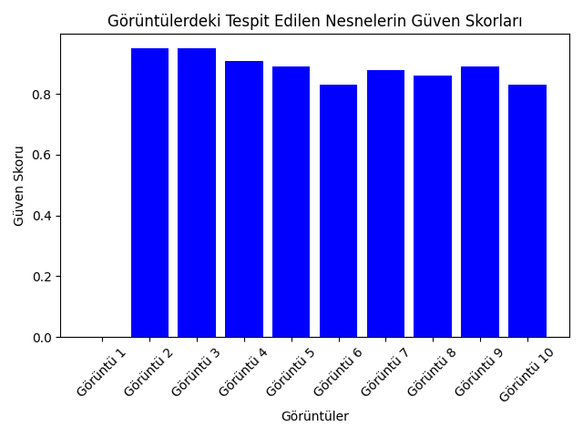
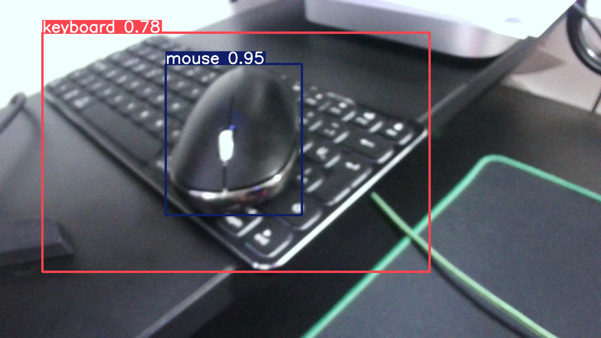

# Nesne Tespiti Projesi

Bu proje, YOLOv8 modeli kullanılarak 10 farklı görüntüde nesne tespiti yapmayı amaçlamaktadır.

## Veri
- 10 farklı görüntü üzerinde çalışılmıştır. Görüntüler, cep telefonu ve dizüstü bilgisayar nesneler içermektedir.

## Kullanılan Model
- Model: YOLOv8m (Medium Model)
- Kütüphane: Ultralytics
- Sürüm: yolov8m.pt

## Çıkarım Süreci
1. Model, Ultralytics kütüphanesi ile yüklendi.
2. Görüntülerdeki nesneler %45 güven skoru ile çıkarıldı.
3. Elde edilen sonuçlar grafikler ve tablolar ile görselleştirildi.

## Tahminler
Model, çoğu nesnede yüksek doğruluk sağladı. Ancak bazı küçük nesneler atlandı ya da yanlış tespit edildi.

## Sonuçlar
Model büyük nesnelerde başarılı olurken, küçük nesnelerde (kulaklık, cüzdan) eksik tespitler yaptı. Genel olarak model performansı %80 üzerindedir.
